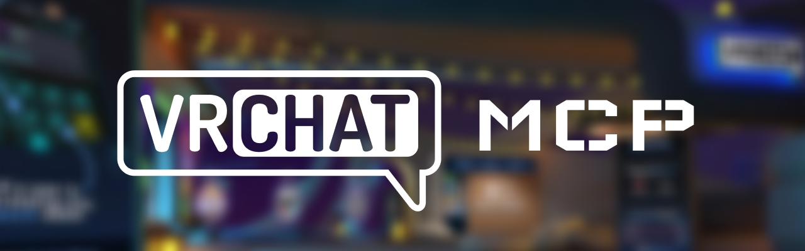

[](https://badge.fury.io/js/vrchat-mcp) [](https://opensource.org/licenses/MIT)

このプロジェクトは、VRChat APIと対話するためのModel Context Protocol (MCP)サーバーです。標準化されたプロトコルを使用してVRChatからさまざまな情報を取得することができます。

<a href="https://youtu.be/0MRxhzlFCkw">
  
</a>

<a href="https://glama.ai/mcp/servers/u763zoyi5a">
  
</a>

## 概要

VRChat MCPサーバーは、VRChatのAPIエンドポイントに構造化された方法でアクセスする手段を提供します。ユーザー認証、ユーザーおよびフレンド情報の取得、アバターやワールドデータへのアクセスなど、幅広い機能をサポートしています。

## 使用方法

サーバーを起動するには、必要な環境変数を設定してください：

```bash
export VRCHAT_USERNAME=your_username
export VRCHAT_PASSWORD=your_password
export VRCHAT_TOTP_SECRET=your_totp_secret
export VRCHAT_EMAIL=your_email@example.com
```

> [!NOTE]
> #### TOTPシークレットの取得方法
> 1. [VRChatプロフィール](https://vrchat.com/home/profile)にアクセスし、二要素認証を有効にします。
> 2. 表示されたQRコードをデコードして、`otpauth://totp/VRChat:your@email.com?secret=XXXXXXXXXXXXXXXXXXX&issuer=VRChat`のような文字列を取得します。
> 3. `XXXXXXXXXXXXXXXXXXX`の部分をTOTPシークレットとして使用します。
>
> **このメソッドにはセキュリティ上の懸念がある可能性があるため、慎重に進めてください。**

その後、以下のコマンドを実行します：

```bash
npx vrchat-mcp
```

これによりMCPサーバーが起動し、定義されたツールを通じてVRChat APIと対話できるようになります。

## Claude Desktopでの使用方法

このMCPサーバーをClaude Desktopで使用する場合、`npx vrchat-mcp`を手動で実行する必要はありません。代わりに、Claude Desktopの設定ファイルに以下の設定を追加してください：

- MacOS: `~/Library/Application Support/Claude/claude_desktop_config.json`
- Windows: `%APPDATA%\Claude\claude_desktop_config.json`

```json
{
  "mcpServers": {
    "vrchat-mcp": {
      "command": "npx",
      "args": ["vrchat-mcp"],
      "env": {
        "VRCHAT_USERNAME": "your-username",
        "VRCHAT_PASSWORD": "your-password",
        "VRCHAT_TOTP_SECRET": "your-totp-secret",
        "VRCHAT_EMAIL": "your-email@example.com"
      }
    }
  }
}
```

その後、通常通りClaude Desktopを起動してください。nodenvやnvmを使用している場合は、`npx`コマンドのフルパスを指定する必要があるかもしれません。

## VRChat APIエンドポイント

以下は、このModel Context Protocolサーバーがサポートしている、またはサポートを予定しているVRChat APIのエンドポイントのリストです。GETおよびPOSTメソッドの両方が含まれており、包括的な機能を提供します。チェックボックスは各エンドポイントの実装状況を示しています。

### 認証とユーザー情報
- [x] 現在のユーザー情報の取得
- [ ] ユーザー検索
- [ ] 特定のユーザープロフィールの取得
- [ ] ユーザーグループの取得
- [ ] プレイヤーモデレーションの取得
- [ ] ユーザーステータスの取得
- [ ] ユーザー情報の更新
- [ ] ユーザーステータスの更新
- [ ] ユーザーのブロック
- [ ] ユーザーのブロック解除

### フレンド関連
- [x] フレンドリストの取得
- [ ] オンラインフレンドの取得
- [x] フレンドリクエストの送信
- [ ] フレンドリクエストの承認/拒否
- [ ] フレンドの削除

### アバター関連
- [ ] 自身のアバターの取得
- [ ] お気に入りアバターの取得
- [x] アバターの検索
- [ ] 特定のアバター詳細の取得
- [ ] パブリックアバターの取得
- [ ] アバターの作成
- [ ] アバターの更新
- [ ] アバターの削除
- [x] アバターの選択
- [ ] アバターのお気に入り登録/解除

### ワールド関連
- [ ] ワールドリストの取得
- [ ] アクティブなワールドの取得
- [ ] 最近訪れたワールドの取得
- [ ] お気に入りワールドの取得
- [x] ワールドの検索
- [ ] 特定のワールド詳細の取得
- [ ] ワールドインスタンスの取得
- [ ] パブリックワールドの取得
- [ ] ワールドの作成
- [ ] ワールドの更新
- [ ] ワールドの削除
- [ ] ワールドのお気に入り登録/解除

### インスタンス関連
- [x] インスタンスの作成
- [x] インスタンス情報の取得
- [ ] インスタンス参加者の取得
- [ ] インスタンスショートネームの取得
- [ ] インスタンスへの参加
- [ ] インスタンスからの退出
- [ ] ユーザーをインスタンスに招待

### ファイル関連
- [ ] ファイル情報の取得
- [ ] ファイルダウンロード情報の取得
- [ ] ファイルステータスの取得

### グループ関連
- [x] グループの検索
- [ ] 特定のグループ情報の取得
- [ ] グループメンバーの取得
- [ ] グループ権限の取得
- [ ] グループリクエストの取得
- [ ] グループ招待の取得
- [ ] グループBANの取得
- [ ] グループギャラリーの取得
- [ ] グループ所有ワールドの取得
- [ ] グループの作成
- [ ] グループの更新
- [ ] グループの削除
- [x] グループへの参加
- [ ] グループからの退出
- [ ] ユーザーをグループに招待
- [ ] グループ招待の承認/拒否
- [ ] ユーザーをグループからBAN
- [ ] ユーザーのグループBANを解除

### 通知関連
- [ ] 通知リストの取得
- [ ] フレンドリクエストの取得
- [ ] 未読通知数の取得
- [ ] 通知を既読にする
- [ ] 通知の削除
- [ ] すべての通知をクリア

### インベントリ関連
- [ ] ライセンスタイプの取得
- [ ] 所有ライセンスの取得
- [ ] ストアリストの取得

### システム関連
- [ ] API設定の取得
- [ ] API制限の取得
- [ ] システムヘルスのチェック
- [ ] オンラインユーザー数の取得
- [ ] サーバーアナウンスの取得

### お気に入り関連
- [x] お気に入り一覧の取得
- [ ] お気に入りの追加
- [ ] お気に入りの削除
- [x] お気に入りグループ一覧の取得
- [ ] お気に入りグループの表示
- [ ] お気に入りグループの更新
- [ ] お気に入りグループのクリア
- [ ] お気に入り制限の取得

### 招待関連
- [x] 招待メッセージ一覧の取得
- [x] 招待リクエストの送信
- [ ] 招待の送信
- [x] 招待メッセージの取得
- [ ] 招待メッセージの更新

### その他
- [ ] タグリストの取得
- [ ] インビジブルリストの取得
- [ ] モデレーションの取得
- [ ] お気に入りグループタイプの取得
- [ ] モデレーションの作成
- [ ] モデレーションの削除

## デバッグ

まず、プロジェクトをビルドします：

```bash
npm install
npm run build
```

MCP サーバーは stdio を介して実行されるため、デバッグが難しい場合があります。最適なデバッグ体験のために、MCP Inspector の使用を強く推奨します。

以下のコマンドで npm を通じて MCP Inspector を起動できます：

```bash
npx @modelcontextprotocol/inspector "./dist/main.js"
```

環境変数が適切に設定されていることを確認してください。

起動すると、Inspector はブラウザでアクセスできる URL を表示します。この URL にアクセスしてデバッグを開始できます。

## パッケージの公開

パッケージを公開するには、以下の手順に従ってください：

1. mainブランチの最新コードをローカルにpullする
   ```bash
   git checkout main
   git pull origin main
   ```

2. 必要に応じてバージョンを更新する
   ```bash
   # パッチバージョンの更新（例：0.1.2 → 0.1.3）
   npm version patch

   # マイナーバージョンの更新（例：0.1.2 → 0.2.0）
   npm version minor

   # メジャーバージョンの更新（例：0.1.2 → 1.0.0）
   npm version major
   ```

3. ビルドを実行する
   ```bash
   npm run build
   ```

4. npmにパッケージを公開する
   ```bash
   npm publish
   ```

5. 変更をリモートリポジトリにプッシュする
   ```bash
   git push origin main --tags
   ```

## コントリビューション

コントリビューションを歓迎します！改善やバグ修正のためのプルリクエストを提出する場合は、リポジトリをフォークしてください。

## ライセンス

このプロジェクトはMITライセンスの下で提供されています。詳細については、LICENSEファイルを参照してください。
